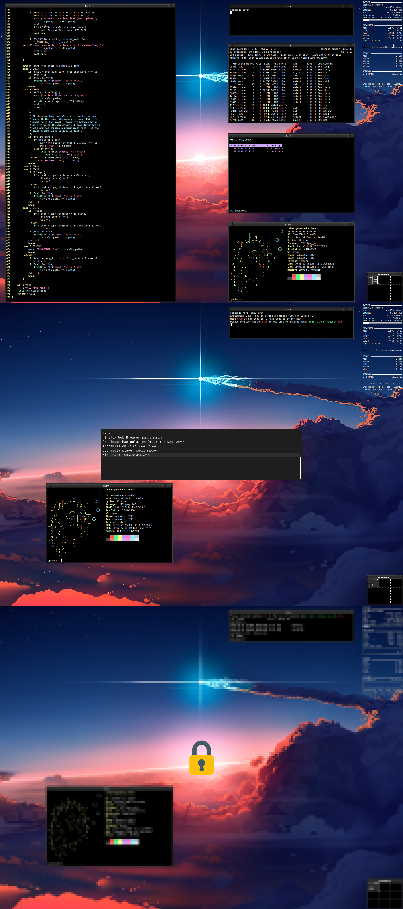

# dotfiles

My OpenBSD dotfiles.

## How to install

1. Create a new user (```adduser```).
2. Run the following commands:
```
# pkg_add unzip wget
# wget https://github.com/crhenr/dotfiles/archive/master.zip -O dotfiles.zip
# unzip dotfiles.zip && cd dotfiles-master
# chmod +x install.sh
# ./install.sh
```

## Result

<p align="center">
  
</p>
