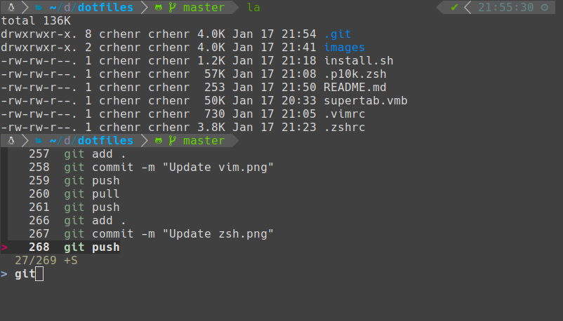
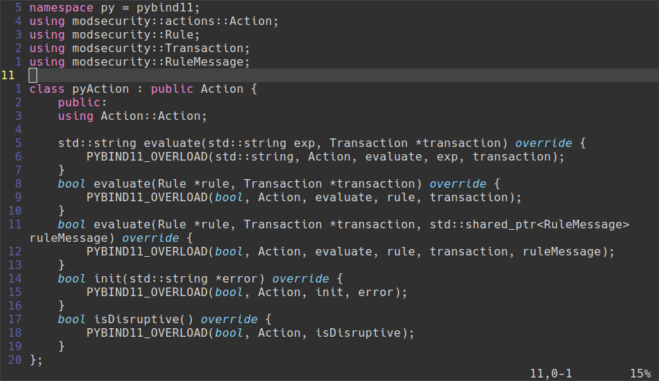

# dotfiles
My dotfiles for zsh and vim.

#### Installation

Run the installation script:

```chmod +x install.sh && ./install.sh```

#### Result

<p align="center">
  
</p>

<p align="center">
  
</p>
